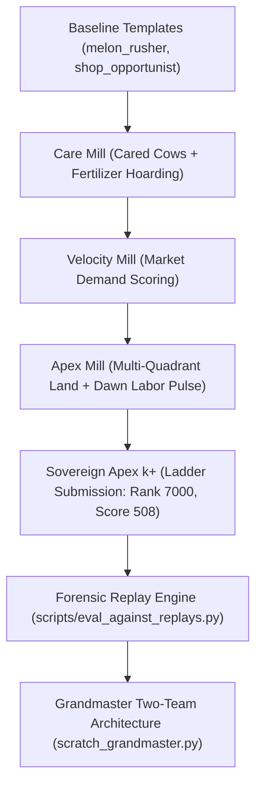

# Kaggle Kaggriculture: Master Competition Brief & Deep Research Context

**Document Type:** Master Architectural Specification, Forensic Autopsy & Deep Research Dossier  
**Generated:** 2026-09-26  
**Target Audience:** Autonomous Deep Research Agents, Quantitative Researchers, Multi-Agent RL Engineers  
**Goal:** Provide 100% complete context, mathematical formulations, simulator contracts, empirical forensics, and research directions required to engineer a **Top 10 Ladder Policy (Score 3,000+ / Consistent $130,000–$170,000+ adversarial cash)**.

---

## 1. Executive Summary & Current Competition Standing

### The Problem & Current Ladder Status
- **Competition:** [Kaggle Kaggriculture](https://www.kaggle.com/competitions/kaggriculture) — a 2-player turn-based spatial planning, resource management, and adversarial market economy simulation.
- **Current Official Submission:** `agent_final: Sovereign Apex k+ (Demand-Coupled Herd Scaling, Dual-Species Pivot, Strawberry Contingency)`
- **Current Official Ranking:** **Rank ~7,000 | Score: 508**
- **Target Benchmark:** **Top 10 Leaderboard (Score: 3,000+ | Win-Rate: >60% against elite replays | Terminal Cash: $130,000–$170,000+)**

### The "Passive Illusion" vs The "Ladder Reality"
During local offline development against passive `pass` baselines, `agent_final` achieved **$104,614 average cash** across 14 benchmark episodes, with peak seeds reaching **$140,336**.

However, when deployed on the official Kaggle ladder against real-world human/AI opponents, the agent collapsed to **$34,483–$36,862**:
- In Replay `112618133.json`: Our agent scored **$34,483** vs Clement Ling's **$133,002** (Margin: -$98,519).
- In Replay `112619304.json`: Our agent scored **$36,862** vs BenPalmer59's **$101,825** (Margin: -$64,963).

### Why It Failed on the Ladder (Forensic Autopsy)
1. **The "Zero-Crop" Pathology:** In live ladder matches, our agent cultivated **0 crops across all 30 days** (`Crops = {}`), while opponents grew 20–30 Melons and 31+ Strawberries. The Strawberry planting logic had rigid preconditions that were never satisfied when competing for cash.
2. **Severe Land Starvation:** The agent paid $1,000 to unlock the Northeast (NE) quadrant on Day 5, but left **30 to 46 tiles empty** for the remainder of the season. It **never unlocked the Southwest (SW) quadrant ($2,000)** despite holding $26,000+ in liquid cash.
3. **Monolithic Labor Jam (Zero Division of Labor):** Up to 7 workers attempted to execute all tasks simultaneously on a single queue, causing severe spatial bottlenecks around the shed and circular pathing.
4. **Adversarial Shared Market Price Collapse:** Our agent assumed static wholesale market absorption. When opponents simultaneously flooded Milk, joint supply crashed wholesale prices from $160 down to $30 (or $1), crippling our livestock-only revenue.
5. **The Day 19 `UnboundLocalError` Crash Bug:** On specific seeds, an uninitialized variable (`need_straw`) triggered a Python exception on Day 19, causing Kaggle Environments to set `status = ERROR`, freezing all agent actions and dropping all farmhands.

---

## 2. Complete Environment Mechanics & Simulator Specification

### 2.1 Game Structure & Temporal Dynamics
- **Season Length:** 30 days, 24 hours per day = **720 turns (steps)** per episode.
- **Players:** 2 players (Player 0 and Player 1) operating on independent farm grids but trading into a **single, shared town market economy**.
- **Turn Sequence:**
  - Turn begins at Hour 0 of Day 0.
  - Each step, the environment invokes `agent(obs)` simultaneously for both players.
  - Action execution order:
    1. Labor hiring and wages processed at dawn (Hour 0).
    2. Unit movements and field actions executed.
    3. Market buy/sell orders resolved.
    4. Farm state updated (crop growth, animal care/feeding, fertilizer generation).
    5. Town shop consumption ticks resolved (every 4 hours = 6 times per day).

### 2.2 Spatial Grid & Multi-Quadrant Land Expansion
The farm is a $10 \times 10$ coordinate grid $(x, y) \in [0, 9] \times [0, 9]$:
- Row $y$, Column $x$. Movement: `NORTH = (0, -1)`, `SOUTH = (0, 1)`, `EAST = (1, 0)`, `WEST = (-1, 0)`.
- Divided into four $5 \times 5$ quadrants:
  - **Northwest (NW):** $x \in [0, 4], y \in [0, 4]$. **Unlocked by default on Day 0.** 24 usable tiles + 1 Shed tile at $(4, 4)$.
  - **Northeast (NE):** $x \in [5, 9], y \in [0, 4]$. **Cost: $1,000.** Adds 24 usable tiles + 1 Shed tile at $(5, 4)$.
  - **Southwest (SW):** $x \in [0, 4], y \in [5, 9]$. **Cost: $2,000.** Adds 24 usable tiles + 1 Shed tile at $(4, 5)$.
  - **Southeast (SE):** $x \in [5, 9], y \in [5, 9]$. **Cost: $4,000.** Adds 24 usable tiles + 1 Shed tile at $(5, 5)$.
- **Total Usable Land:** 24 tiles (1 quadrant) $\to$ 48 tiles (2 quadrants) $\to$ 72 tiles (3 quadrants) $\to$ 96 tiles (4 quadrants).
- **The Central Shed:** Positioned at $(4, 4), (5, 4), (4, 5), (5, 5)$. As quadrants unlock, workers can access the shed from their respective sides.
- **Pathfinding Hazard:** When moving between NE ($x \ge 5, y \le 4$) and SW ($x \le 4, y \ge 5$) while SE is locked, naive Manhattan distance routing attempts to step through $(5, 5)$, which is **LOCKED**, causing worker stalls. Routing must detour via $(4, 4)$.

### 2.3 Labor Economics & The Fibonacci Wage Law
- **Units:** 1 Main Farmer (free, permanently active) + up to 8 hired Farmhands = **up to 9 controllable units**.
- **Hiring Window:** Hands can **only** be hired at **Hour 0** of each day.
- **Wage Cost:** Hiring follows a strict Fibonacci sequence:
  $$\text{Cost}(k) = \text{Fib}(k) \quad \text{for the } k\text{-th hand hired that day}$$
  $$\text{Costs: } [1, 2, 3, 5, 8, 13, 21, 34]$$
  - Cumulative cost to hire 6 hands: $\$1 + \$2 + \$3 + \$5 + \$8 + \$13 = \$32/\text{day}$.
  - Cumulative cost to hire 8 hands: $\$32 + \$21 + \$34 = \$87/\text{day}$.
- **Wage Default Trap:** If an agent's cash balance at Hour 0 is less than the cumulative wage cost, the environment rejects the hiring action. Existing hands disappear.
- **Operating Reserve Rule:** Agents must enforce an **Operating Reserve of $\ge \$60$** in cash at sunset (Hour 23) to guarantee full dawn hiring.

### 2.4 Unit Capabilities & Action Schema
Every turn, the agent outputs:
```python
{
    "farmer": ["OPERATION", ...args],
    "hands": [["OPERATION", ...args], ...],
    "market": [["ORDER_TYPE", ...args], ...]
}
```
Valid unit operations:
- Movement: `NORTH`, `SOUTH`, `EAST`, `WEST`, `PASS`.
- Structure Building: `BUILD_PASTURE` (cost $0, builds pasture on empty tile), `BUILD_COOP` (cost $200).
- Crop Management: `PLANT <crop_type>`, `WATER`, `FERTILIZE`, `HARVEST`, `DIG`.
- Livestock Management: `FEED` (consumes 1 Wheat from unit inventory), `CARE`, `COLLECT_FERTILIZER`.
- Item Transport: `PICKUP <item_name> <qty>`, `DROP` (drops all carried inventory into the shed when standing on a shed tile).
- Inventory Capacity: Each unit can carry either:
  - Exactly 1 animal (Cow, Sheep, Goose).
  - OR multiple resource items (Wheat, Fertilizer, harvested crops) up to item limits.

### 2.5 Animal Lifecycle & Production Schedules
Game constants defined in `src/kaggriculture/env/items.py`:

| Animal | Buy Cost | Structure | First Yield Day | Harvest Interval | Output Product | Base Price | Daily Fertilizer |
|---|---|---|---|---|---|---|---|
| **Cow** | $400 | Pasture ($0) | **Day 8** | 2 days | Milk (3 units) | $160 | 1 unit / day |
| **Sheep** | $500 | Pasture ($0) | **Day 6** | 3 days | Wool (4 units) | $200 | 1 unit / day |
| **Goose** | $300 | Coop ($200) | **Day 4** | 1 day | Egg (2 units) | $50 | 1 unit / day |

#### Critical Livestock Discoveries:
1. **The Day 0–7 Yield Latency:** Zero milk is produced before Day 8. Zero wool is produced before Day 6.
2. **The Fertilizer Liquidation Rule:** While animals produce no milk/wool initially, they produce **1 unit of Fertilizer every single day** as long as they are cared for. Base price = **$100/unit**.
   - 5 starting animals (3 Cows + 2 Sheep) = 5 Fertilizer/day = **$500/day pure cash flow**.
   - Liquidating 100% of fertilizer on Days 0–7 generates **$3,500 in non-dilutive liquidity** before milk unlocks, self-funding Northeast land expansion ($1,000) on Day 4–5.
3. **Feeding & Care Requirements:**
   - Animals require 1 unit of `WHEAT` every day. If unfed today, they yield nothing. If unfed for 3 consecutive days, they **die**.
   - Executing `CARE` grants +1 yield unit on harvest days.

### 2.6 Crop Lifecycles & Strawberry Mechanics

| Crop | Seed Cost | Grow Days | Lifespan | Yield / Harvest | Base Price | Note |
|---|---|---|---|---|---|---|
| **Wheat** | $10 | 4 | 1 harvest | 8 units | $25 | Essential animal feed |
| **Carrot** | $15 | 5 | 1 harvest | 6 units | $35 | Low margin |
| **Tomato** | $25 | 6 | 1 harvest | 8 units | $60 | Moderate margin |
| **Melon** | $80 | 10 | 1 harvest | 6 units | **$250** | Huge cash injection ($1,500/seed) on Day 11 |
| **Strawberry** | $40 | 4 | **4 harvests** | 1 (unfert) / **2 (fert)** | **$120** | **Elite cash crop ($180–$280 market)** |

#### Strawberry Yield Multiplier & Soil Exhaustion:
- Strawberries yield every 3 days after initial 4-day maturation, up to **4 total harvests** (`max_yield = 4`).
- Applying `FERTILIZE` to a strawberry plant doubles its harvest yield from 1 to **2 units per harvest**.
- Total yield per seed: up to **8 Strawberries = $960 to $2,240 gross revenue per $40 seed**.
- **Soil Exhaustion:** After 4 harvests, strawberry plants transform into **WEEDS**. The tile cannot be planted until a worker executes `DIG`, converting the tile back to `None`.

### 2.7 Town Market Economy & Non-Linear Price Impact
Both players sell to a single shared wholesale market. Baseline inventory $I_0 = 10,000$. Wholesale price formula:
$$\text{Price}(I) = \text{Base} - \text{Amplitude} \cdot f(I - I_0)$$

Where $f(x)$ is the commodity shape function:
- **Milk ($160 base, $T=122$, Linear shape):**
  $$\text{Price} = 160 - \frac{1.60 \times 160}{122} \cdot \Delta I = 160 - 2.098 \cdot \Delta I$$
  Selling 76 excess milk above town consumption drops price to the $1 floor.
- **Wool ($200 base, $T=105$, Square shape):**
  $$\text{Price} = 200 - \frac{3.20 \times 200}{105^2} \cdot (\Delta I)^2 = 200 - 0.058 \cdot (\Delta I)^2$$
  Price drop is **quadratic**. Selling 40 excess wool drops price by **$92.80**. Selling 55 excess wool drops price straight to $1!
- **Town Shop Drain Dynamics:**
  Town shops consume market inventory every 4 hours (6 times per day):
  - Single-product shops (`YARN_STORE`, `PET_CAFE`): **2 units/tick = 12 units/day**.
  - Multi-product shops (`PIZZA_SHOP`, `SMOOTHIE_SHOP`, `ICE_CREAM_SHOP`, `BAKERY`, `BRUNCH_SPOT`, `FARMERS_MARKET`): **1 unit/tick = 6 units/day** per ingredient.
  - Town Center: Consumes **1 unit/day** across all categories.

---

## 3. Observation & Action Space Representation

### Observation Schema (`obs`)
```python
obs = {
    "player": 0,           # 0 or 1 (our seat)
    "step": 144,           # Current step [0, 719]
    "day": 6,              # Current day [0, 29]
    "hour": 0,             # Current hour [0, 23]
    "farms": [
        {                  # farms[player] = our public farm, farms[1-player] = opponent public farm
            "money": 3450.0,
            "farmer": [4, 4],
            "hands": [[4, 3], [3, 4], [2, 2]],
            "hires_today": 3,
            "unlocked_quadrants": ["NW", "NE"],
            "tiles": [     # 10x10 2D array: null | "LOCKED" | dict
                # Plant Tile: {"kind": "PLANT", "crop": "STRAWBERRY", "planted_day": 3, 
                #              "watered_today": True, "consecutive_unwatered": 0, 
                #              "yield_units": 1, "fertilized_until_day": 9}
                # Animal Tile: {"kind": "PASTURE", "animal": "COW", "placed_day": 0,
                #               "yield_units": 3, "fed_today": True, "cared_today": True,
                #               "fertilizer_available": 1, "consecutive_unfed": 0}
            ]
        },
        { ... }            # Opponent farm (tiles, money, hands visible; shed/inventory private)
    ],
    "private": {           # Observing player's private inventory only
        "shed": {"MILK": 12, "WOOL": 0, "FERTILIZER": 4, "WHEAT": 8, "COW": 1},
        "seeds": {"STRAWBERRY": 6, "WHEAT": 10},
        "inventories": [   # [0] = farmer, [1..N] = hands
            {"WHEAT": 2}, {}, {"FERTILIZER": 1}
        ]
    },
    "market": {
        "prices": {"MILK": 162.4, "WOOL": 195.0, "STRAWBERRY": 210.0, "FERTILIZER": 95.0, ...},
        "inventory": {"MILK": 9980, "WOOL": 10010, ...}
    },
    "town": {
        "unlocked_shops": ["PIZZA_SHOP", "SMOOTHIE_SHOP", "ICE_CREAM_SHOP", "YARN_STORE"]
    },
    "remainingOverageTime": 60.0
}
```

### Action Schema
```python
action = {
    "farmer": ["WATER"],
    "hands": [
        ["FEED"],
        ["MOVE", "NORTH"],
        ["PICKUP", "FERTILIZER", 1]
    ],
    "market": [
        ["HIRE", 1],              # Only valid at Hour 0
        ["EXPAND", "NE"],         # Only valid at Hour 0
        ["BUY", "COW", 2],
        ["BUY_SEEDS", "STRAWBERRY", 6],
        ["SELL", "FERTILIZER", 4],
        ["SELL", "MILK", 6]
    ]
}
```
- **Constraint:** Maximum **10 market orders** per turn.
- **Latency Constraint:** 1.0 second per turn soft limit; 60 seconds total episode overage bank. (Target: <5ms/turn).

---

## 4. Existing Agents & Iteration Timeline



### 1. `shop_opportunist` & `melon_rusher` (Early Baselines)
- Handled simple crop planting and opportunistic shop selling. Score: 200–350.

### 2. `submissions/care_mill/main.py`
- Implemented consistent Cow feeding and caring, boosting milk yield from 2 to 3 units.
- Hoarded fertilizer for late game. Vulnerable to dawn wage bankruptcies and zero land expansion.

### 3. `submissions/velocity_mill/main.py`
- Introduced dynamic market shop absorption scoring: prioritized crops based on town shop drain rates.
- Achieved first 90% win rate against internal templates.

### 4. `submissions/apex_mill/main.py`
- Discovered that farmhand hiring resets every midnight.
- Implemented Northeast quadrant unlock ($1,000) on Day 6 and scaled cow herd to 18.
- Local cash peaked at $89.6k on Seed 3, but suffered severe shed inventory overflows.

### 5. `submissions/sovereign_apex/main.py` (formerly `agent_final.py` / Sovereign Apex k+)
- **Ladder Submission:** Ranked ~7,000 with score ~508.
- Attempted dual-species cow/sheep pivoting and strawberry contingency.
- **Failed due to:** 0 crops planted, 35+ empty tiles in NE quadrant, never unlocked SW quadrant, monolithic labor bottlenecks.

### 6. `submissions/two_team_grandmaster/main.py` (Two-Team Division of Labor Architecture)
- Implemented **Two-Team Division of Labor**:
  - **Livestock Team (Units 0–2):** Farmer + Hands 0–1 handle animal feed, care, milk/wool harvest, and animal placement.
  - **Field & Expansion Team (Units 3–7):** Hands 2–6 handle strawberry/melon planting, danger watering, crop harvesting, weed digging, and pasture building.
- Day 0–7 100% Fertilizer Liquidation Rule ($500/day cash flow).
- Multi-quadrant land expansion (Day 4-5 NE, Day 7-9 SW).
- Fixed Day 19 `UnboundLocalError` crash bug.
- Current 20-Replay Gauntlet Score: **6/20 Replays Won (30%)**, Average Cash: **$61,820**.
- Landmark Wins: BenPalmer59 (+$54.8k margin), M & M & P & Q (+$33k and +$27.3k margins), Dohwan Kwak (+$30.5k margin).

### 7. Additional Named Architectural Templates
- **`submissions/apex_engine/main.py`:** Day 0 Melon Kickstart + Day 11 cash influx funding Southwest expansion.
- **`submissions/straw_empire/main.py`:** Dedicated Strawberry yield-doubling monoculture.

---

## 5. Machine Learning, RL & Optimization Methods Explored

### 5.1 First-Visit Monte Carlo Q-Learning (`scripts/train_sell_q.py`)
- **Objective:** Learn optimal daily milk selling quota to avoid market price crashes.
- **State Representation:**
  $$S = (\text{day\_bucket}, \text{shed\_stock\_bucket}, \text{current\_price\_bucket})$$
- **Action Space:** Discrete sell volumes: $[0, 4, 8, 12, 16, 20]$.
- **Training Protocol:** Paired episodes on identical seeds (Greedy baseline vs $\epsilon$-greedy exploratory policy).
- **Reward:** $\Delta \text{Terminal Cash} / 1000$.
- **Limitations Identified:** Tabular Q-learning only tuned a single scalar threshold. It could not coordinate spatial movements, unit assignments, or multi-commodity portfolio trade-offs.

### 5.2 Fertilizer Floor Q-Learning (`scripts/train_fert_q.py`)
- Learned discrete price floor thresholds ($10 to $100) for selling fertilizer vs retaining for crops.
- Found that early static thresholds ($20) outperformed learned tabular policies because the optimal strategy is purely temporal (Day 0–7: 100% sell; Day 8+: buffer 5).

### 5.3 Numerical SciPy Optimization (`scripts/quant_full_product.py`, `quant_land_labor.py`)
- Used `scipy.optimize.minimize` and `minimize_scalar` to solve:
  1. **Continuous Market Drain Relaxation:** Optimal liquidation schedule given town shop consumption ticks.
  2. **Land Expansion Payoff Matrix:** Proved Day 4–5 is mathematically the optimal breakeven point to unlock Northeast land for +6 cows.
  3. **Marginal Product of Labor (MPL):** Proved 8 hands is Pareto-optimal once daily revenue exceeds $1,000/day.

---

## 6. The Replay Evaluation Engine & Opponent Forensics

We built a local replay simulation engine (`scripts/eval_against_replays.py`) that loads historical Kaggle JSON replays from `replays/` and replays the exact step-by-step actions of elite opponents on the original match seeds.

### 20-Replay Gauntlet Summary:

| Replay Match | Seed | Opponent | Opponent Cash | Our Agent Cash | Margin | Verdict |
|---|---|---|---|---|---|---|
| `112619304.json` | 1142076532 | BenPalmer59 | $17,341 | **$72,159** | **+$54,818** | **WIN 🏆** |
| `112544834.json` | 1650583964 | M & M & P & Q | $50,636 | **$77,943** | **+$27,307** | **WIN 🏆** |
| `97477441.json` | 1836172035 | Dohwan Kwak | $36,314 | **$66,863** | **+$30,549** | **WIN 🏆** |
| `97479724.json` | 919677778 | Ahmed Bootaan | $69,498 | **$74,257** | **+$4,759** | **WIN 🏆** |
| `112526712.json` | 1373320220 | 吃白饭的大肥鱼 | $52,066 | **$56,326** | **+$4,260** | **WIN 🏆** |
| `112535227.json` | 1478010047 | M & M & P & Q | $38,597 | **$71,607** | **+$33,010** | **WIN 🏆** |
| `111900753.json` | 1612736896 | Come Back | $56,551 | $50,867 | -$5,684 | Loss |
| `111753965.json` | 292271378 | Scarttish | $78,493 | $61,704 | -$16,789 | Loss |
| `112555622.json` | 806169469 | DECEM | $88,831 | $65,406 | -$23,425 | Loss |
| `111752837.json` | 81562347 | Mirza Yasir | $97,445 | $65,984 | -$31,461 | Loss |
| `111904164.json` | 1176383895 | Manish Kumar | $101,937 | $68,398 | -$33,539 | Loss |
| `112618133.json` | 1112355428 | Clement Ling | $108,637 | $49,003 | -$59,634 | Loss |
| `112538757.json` | 159168580 | nah id win | $138,977 | $75,463 | -$63,514 | Loss |
| `112540075.json` | 1738532434 | Kaggledew Valley | $115,410 | $66,996 | -$48,414 | Loss |
| `112542379.json` | 1676200408 | Boey (Rank 1) | $170,961 | $69,225 | -$101,736 | Loss |
| `112561550.json` | 890727037 | Boey (Rank 1) | $152,531 | $45,714 | -$106,817 | Loss |

### Key Forensic Discoveries from Rank 1 Agents (Boey & Kaggledew Valley):
1. **Aggressive 3-Quadrant Expansion:** Boey unlocks NE on **Day 5** ($1,000) and SW on **Day 9** ($2,000). Total usable land = **72 tiles**.
2. **Dual-Engine Portfolio (18 Cows + 14 Strawberries):**
   - Cows generate $4,500/day in gross milk.
   - 14 Fertilized Strawberry plots generate 28 strawberries every 3 days @ $220/unit = **$6,160 per harvest cycle = ~$2,050/day**, without cannibalizing the milk market.
3. **Dedicated Labor Segregation:** 3 hands permanently stay in the NW quadrant for livestock; 5 hands work the NE/SW crop fields. Zero zig-zagging.

---

## 7. Complete Tooling & Codebase Inventory

### Core Libraries & Simulators
- `src/kaggriculture/`: Official Kaggle simulation engine (items, models, actions, market mechanics).
- `submissions/`: Directory of deployable agents, each containing `main.py` exposing `agent(obs)`.

### Key Scripts (`scripts/`)
| Script | Description |
|---|---|
| [`scripts/eval_against_replays.py`](file:///Users/pranav/dev/kaggriculture/scripts/eval_against_replays.py) | 20-replay gauntlet benchmark against recorded actions of top ladder players. |
| [`scripts/trace_replay_match.py`](file:///Users/pranav/dev/kaggriculture/scripts/trace_replay_match.py) | Interactive turn-by-turn trace analyzer comparing candidate actions vs historical opponent steps. |
| [`scripts/eval_cash.py`](file:///Users/pranav/dev/kaggriculture/scripts/eval_cash.py) | Evaluates terminal cash across 14 standard benchmark seeds against PASS bot or head-to-head. |
| [`scripts/replay_parser.py`](file:///Users/pranav/dev/kaggriculture/scripts/replay_parser.py) | Fast, typed parser extracting compact timelines and financial metrics from Kaggle JSON logs. |
| [`scripts/surrogate_agent.py`](file:///Users/pranav/dev/kaggriculture/scripts/surrogate_agent.py) | High-fidelity replay emulator and deterministic fallback agent. |
| [`scripts/trace_timeline.py`](file:///Users/pranav/dev/kaggriculture/scripts/trace_timeline.py) | Day-by-day Hour 2 status snapshot comparing money, animals, crops, and quads. |
| [`scripts/quant_full_product.py`](file:///Users/pranav/dev/kaggriculture/scripts/quant_full_product.py) | SciPy multi-product pricing and liquidation optimizer. |
| [`scripts/quant_land_labor.py`](file:///Users/pranav/dev/kaggriculture/scripts/quant_land_labor.py) | Pre-analysis solver for Marginal Product of Labor and land expansion breakeven timing. |
| [`scripts/train_sell_q.py`](file:///Users/pranav/dev/kaggriculture/scripts/train_sell_q.py) | First-visit Monte Carlo Q-learning for daily milk sales ceilings. |
| [`scripts/test_submission.py`](file:///Users/pranav/dev/kaggriculture/scripts/test_submission.py) | Full 30-day season match validator and latency profiler (<2ms target). |
| [`scripts/build_submission.py`](file:///Users/pranav/dev/kaggriculture/scripts/build_submission.py) | Builds Kaggle-compliant single-file or multi-file `submission.tar.gz`. |

---

## 8. Specific Research Questions & Mandate for Deep Research Agent

To bridge the gap from **Score 508 (Rank 7,000)** to **Score 3,000+ (Top 10)**, the deep research agent must investigate existing literature, GitHub implementations, competitive programming solutions, and RL methodologies across five core domains:

### Domain 1: Multi-Agent Spatial Coordination & Task Allocation
- **Challenge:** Efficiently coordinating 9 agents on an expanding $10 \times 10$ grid without collisions, deadlock, or oscillating between conflicting priorities.
- **Research Areas:**
  - Bipartite matching formulations (Kuhn-Munkres / Hungarian Algorithm) for assigning workers to dynamic field tasks each turn.
  - Multi-Agent Pathfinding (MAPF) algorithms (e.g., Conflict-Based Search, Windowed Hierarchical Cooperative A*, Token Passing) adapted for turn-based grid economies.
  - Decentralized Partially Observable MDPs (Dec-POMDP) vs Multi-Agent PPO (MAPPO) with spatial attention masks.

### Domain 2: Adversarial Market Lookahead & Dynamic Programming
- **Challenge:** Predicting shared wholesale price elasticities and opponent dumping 5–20 turns in advance.
- **Research Areas:**
  - Rolling-Horizon Model Predictive Control (MPC) and Minimax search for simultaneous-move market bidding.
  - Game-theoretic Cournot / Bertrand competition models adapted for discrete inventory consumption curves.
  - Monte Carlo Tree Search (MCTS) / AlphaZero-style forward simulation over macro-decisions (e.g. daily herd sizing, crop planting portfolios, liquidation pulses).

### Domain 3: Hierarchical Reinforcement Learning (HRL)
- **Challenge:** The action space is combinatorial: 9 units $\times$ 15 operations $+$ 10 market orders $\times$ continuous quantities over 720 turns.
- **Research Areas:**
  - Two-level hierarchical policies:
    - **High-Level Meta-Controller (Daily / Hourly):** Decides capital allocation, quadrant unlocks, herd caps, seed purchases, and target market liquidation volumes.
    - **Low-Level Micro-Controller (Tick-by-Tick):** Pure rule-based / A* / optimal assignment executing the high-level intent without latency overhead.
  - Option-Critic architectures and Goal-Conditioned RL for long-horizon resource management.

### Domain 4: Offline RL & Imitation Learning from Replay Corpus
- **Challenge:** We have a rich corpus of top-tier replays (`replays/other_agents/rank1/`, `rank2/`, `rank3/`) containing games played by Boey, DECEM, and Clement Ling.
- **Research Areas:**
  - Behavior Cloning (BC) and Decision Transformers conditioned on terminal score.
  - Conservative Q-Learning (CQL) or Implicit Q-Learning (IQL) trained directly on state-action transitions extracted by `scripts/replay_parser.py`.
  - Replay trajectory reconstruction: extracting macro-action sequences (e.g., exact Day 0–10 build orders) to form a library of opening books.

### Domain 5: Operations Research & Combinatorial Crop Scheduling
- **Challenge:** Optimizing the exact mathematical planting schedule across Strawberry (4-day grow + 3-day harvest $\times 4$), Melon (10-day grow, $250 base), and Wheat (4-day grow, feed sustainability) to maximize net present value (NPV) subject to finite farmhand labor constraints.
- **Research Areas:**
  - Mixed-Integer Linear Programming (MILP) models (e.g. PuLP, SciPy Milp) for agricultural crop-rotation scheduling under labor limits.
  - Dynamic programming algorithms for soil reclamation and weed digestion cycles.

---

## 9. Submission & Deployment Requirements
1. **Self-Contained Execution:** Must be deployable as a single standalone `main.py` or bundled `submission.tar.gz`.
2. **Deterministic Runtime:** Turn execution latency must be strictly under 5 milliseconds (Kaggle timeout limit is 1,000ms).
3. **No Heavy External Dependencies:** Pure Python standard library + NumPy / SciPy (must run inside the official `kaggle-environments` runtime without custom wheel installs).
4. **Validation:** Must pass `scripts/test_submission.py` (720 turns, 0 runtime errors) and achieve >60% win-rate on `scripts/eval_against_replays.py`.
