# Research Report 20: Replay Forensics, Game Mechanics Discoveries & Gauntlet Findings

**Phase:** Quantitative Discovery & Opponent Forensic Reconstruction  
**Generated:** 2026-09-24  
**Author:** Antigravity Autonomous Quantitative Research Team  

---

## 1. Executive Summary

This report documents the forensic analysis of 20 top-tier real-world ladder match replays (`replays/`), the quantitative discovery of core game mechanics governing animal yield curves and market dynamics, and the empirical findings from evaluating candidate policies against historical ladder opponents (including Boey, Clement Ling, DECEM, BenPalmer59, Kaggledew Valley, Scarttish, and 吃白饭的大肥鱼).

Through step-by-step replay parsing and simulation tracing, we reverse-engineered the mathematical mechanisms separating sub-600 score agents from 3,000+ score elite ladder champions. These insights directly inform the **Two-Team Division of Labor Architecture** implemented in [`scratch_grandmaster.py`](file:///Users/pranav/dev/kaggriculture/scratch_grandmaster.py).

---

## 2. Key Game Mechanics Discoveries

### A. Animal Production Schedules and Yield Latency

Analysis of the game engine constants in [`src/kaggriculture/env/items.py`](file:///Users/pranav/dev/kaggriculture/src/kaggriculture/env/items.py) revealed strict production schedules that fundamentally govern early-game return on investment (ROI):

| Animal | Purchase Cost | Structure | First Yield Day | Harvest Interval | Output Product | Base Price | Daily Fertilizer |
|---|---|---|---|---|---|---|---|
| **Cow** | $400 | Pasture ($0) | **Day 8** | 2 days | Milk (3 units) | $160 | 1 unit / day |
| **Sheep** | $500 | Pasture ($0) | **Day 6** | 3 days | Wool (4 units) | $200 | 1 unit / day |
| **Goose** | $300 | Coop ($200) | **Day 4** | 1 day | Egg (2 units) | $50 | 1 unit / day |

#### The "Zero Early Milk/Wool" Realization:
- **Cows produce zero milk prior to Day 8.** Even if fed and cared for every turn from Day 0, the first milk harvest only triggers at Day 8 Hour 0.
- **Sheep produce zero wool prior to Day 6.**
- **Consequence for Naive Agents:** Naive agents that invest $2,000+ into cows on Day 0 and hoard fertilizer waiting for crops face a severe liquidity trap: they generate $0 cash flow between Days 0 and 7 while burning wages every dawn.

### B. The Day 0–7 100% Fertilizer Liquidation Rule

While cows and sheep produce no milk or wool before Days 8/6, they produce **1 unit of fertilizer per animal every single day** as long as they are cared for.

- Base fertilizer wholesale value: **$100 / unit**.
- With 5 starting animals (3 cows + 2 sheep), daily fertilizer production = **5 units/day = $500/day**.
- **Strategic Rule:** On Days 0–7, 100% of collected fertilizer must be liquidated immediately at wholesale. This unlocks **$3,500 in cumulative cash flow** before the first drop of milk is harvested, self-funding the Northeast land expansion ($1,000) and additional breeding stock without taking on wage debt.
- On Days 8+, a 5-unit buffer is retained in the shed so field hands can fertilize strawberry crops.

### C. Strawberry Cash Crop Dynamics & Soil Exhaustion

Forensic inspection of top agents (`scripts/inspect_crop_types.py` and `scripts/trace_timeline.py`) revealed that elite players (e.g. Boey, DECEM) never rely solely on livestock. They aggressively cultivate **Strawberries**:

1. **Wholesale Margin:** Strawberry base price is $120, and shop consumption from Ice Cream Shops, Smoothie Shops, and Brunches regularly pulls wholesale prices to **$180–$280**.
2. **Yield Mechanics:** 
   - Normal yield: 1 unit per harvest.
   - Fertilized yield: **2 units per harvest** (`fertilized_until_day >= current_day`).
   - Harvest interval: 3 days.
   - Total lifespan: **4 harvests** (`max_yield = 4`), yielding up to 8 strawberries per seed ($1,000–$1,800 revenue per $120 seed).
3. **Soil Exhaustion & Weed Digging:** After 4 harvests, strawberry plants expire and transform into **WEEDS**. If an agent fails to prioritize the `DIG` action on weeds, the farm grid locks up. Elite agents prioritize digging expired strawberry tiles back to empty (`None`), allowing continuous replanting cycles.

### D. Non-Linear Market Pricing & Quadratic Wool Risk

Market prices in Kaggriculture are computed via net wholesale inventory deviation from baseline $I_0 = 10,000$:

$$\text{Price}(I) = \text{Base} - \text{Amplitude} \times f(I - I_0)$$

Where the shape function $f(x)$ differs drastically by commodity:
- **Milk ($160 base, $T=122$, Linear shape):**
  $$\text{Price} = 160 - \frac{1.60 \times 160}{122} \times \Delta I = 160 - 2.098 \times \Delta I$$
  Price drops linearly by ~$2.10 per excess unit sold. Oversupply of 76 units drives price to $1.
- **Wool ($200 base, $T=105$, Square shape):**
  $$\text{Price} = 200 - \frac{3.20 \times 200}{105^2} \times (\Delta I)^2 = 200 - 0.058 \times (\Delta I)^2$$
  Price drops **quadratically**. Selling 40 excess units inflicts an immediate -$92.80 penalty. At 55 excess units, wool price crashes straight to $1.
- **Practical Takeaway:** Wool is hyper-profitable in small batches but catastrophic if over-produced. The agent must maintain a strict herd cap on sheep matching town shop absorption (`YARN_STORE`).

### E. Town Shop Absorption Rates

Town shops consume goods every 4 turns (6 consumption ticks per 24-hour day):
- **Single-Product Shops** (`YARN_STORE`, `PET_CAFE`): Consume **2 units/tick = 12 units/day**.
- **Multi-Product Shops** (`PIZZA_SHOP`, `SMOOTHIE_SHOP`, `ICE_CREAM_SHOP`, `BAKERY`, `BRUNCH_SPOT`, `FARMERS_MARKET`): Consume **1 unit/tick = 6 units/day** per ingredient.
- **Town Center:** Consumes **1 unit/day** across all categories.

### F. Fibonacci Dawn Labor Cost Schedule

Every morning at Hour 0, hiring farmhands incurs a Fibonacci wage cost:
$$\text{Cost}(k) = \text{Fib}(k) \quad \text{for } k \in [1, 8]$$
Sequence: $1, $2, $3, $5, $8, $13, $21, $34 (Total for 8 hands = $87/day).

- **Wage Default Trap:** If an agent's cash balance drops below the cumulative wage cost, the environment rejects hiring actions, and existing hands go unpaid.
- **Operating Reserve Rule:** The agent must enforce a strict **$60 Operating Reserve** in its market order planner, ensuring it never spends cash below $60 at sunset (Hour 23).

---

## 3. Top Opponent Replay Forensics

Using [`scripts/replay_parser.py`](file:///Users/pranav/dev/kaggriculture/scripts/replay_parser.py), [`scripts/trace_timeline.py`](file:///Users/pranav/dev/kaggriculture/scripts/trace_timeline.py), and [`scripts/trace_replay_match.py`](file:///Users/pranav/dev/kaggriculture/scripts/trace_replay_match.py), we conducted forensic timeline analyses on the strongest agents in the Kaggle leaderboard:

### 1. Boey (Rank 1 — $170,961 in `112542379.json`)
- **Land Expansion:** Unlocked NE quadrant on **Day 5** ($1,000), SW quadrant on **Day 9** ($2,000). Total farm size: 72 usable tiles.
- **Asset Allocation by Day 15:** 18 Cows, 6 Sheep, 14 Strawberry plots, 8 farmhands.
- **Cash Flow Transition:** High-volume early fertilizer sales funded Day 5 NE purchase. Transitioned into 14 strawberry plots when wholesale strawberry was at $240.
- **Labor Strategy:** 8 hands permanently hired starting Day 6. Perfect segregation: 3 hands dedicated to livestock feeding/caring, 5 hands dedicated to strawberry watering and harvesting.

### 2. Clement Ling (Rank 1 — $108,637 in `112618133.json`)
- **Strategy:** Aggressive Cow specialization with early pasture pre-building.
- **Market Timing:** Never sold milk in small increments of 1-2 units. Batched milk in units of 12-16 exactly synchronized with Pizza and Ice Cream shop consumption pulses.

### 3. DECEM (Rank 2 — $88,831 in `112555622.json`)
- **Strategy:** Multi-tape router pivoting between Wool and Strawberries. When the opponent produced milk, DECEM flooded the market with Wool and Strawberries, exploiting uncontested shop demand.

### 4. BenPalmer59 (Rank 2 — `112619304.json`)
- **Vulnerability Discovered:** BenPalmer59 aggressively over-bought sheep without checking town shop demand. In shared matches, when our agent supplied sheep and drove wholesale wool price down, BenPalmer59 suffered quadratic price collapse, finishing with only $17,341 while our agent won with **$72,159 (+54,818 margin)**.

---

## 4. The Two-Team Division of Labor Architecture

In [`scratch_grandmaster.py`](file:///Users/pranav/dev/kaggriculture/scratch_grandmaster.py), we resolved worker pathfinding congestion and role interference by formalizing the **Two-Team Division of Labor**:

```mermaid
flowchart TD
    Dawn["Dawn (Hour 0): Hire Hands & High-Frequency Sells"] --> TeamSplit{"Worker Role Assignment"}
    
    subgraph LivestockTeam ["Livestock Team (Units 0-2: Farmer + Hands 0-1)"]
        L1["1. Act on Animal Underfoot (Feed / Care / Milk / Wool)"]
        L2["2. Feed Hungry Livestock (Deliver Wheat)"]
        L3["3. Retrieve Wheat from Shed"]
        L4["4. Place Carried Animals in Open Pastures"]
        L5["5. Retrieve Purchased Animals from Shed"]
        L6["6. Collect Fertilizer (Days 0-7: 100% Sell; Days 8+: Keep 5 Buffer)"]
        L7["7. Drop Goods at Shed"]
        L1 --> L2 --> L3 --> L4 --> L5 --> L6 --> L7
    end
    
    subgraph FieldTeam ["Field & Expansion Team (Units 3-7: Hands 2-6)"]
        F1["1. Deliver Fertilizer to Underfoot / Target Strawberry"]
        F2["2. Water Danger Crops (consecutive_unwatered >= 1)"]
        F3["3. Harvest Ripe Crops (Strawberry / Melon / Wheat)"]
        F4["4. Plant Strawberries on Open Tiles (Cash Engine)"]
        F5["5. Plant Melons (Compounding Capital Injection)"]
        F6["6. Plant Wheat (Feed Reserve)"]
        F7["7. Routine Watering of Thirsty Plants"]
        F8["8. Dig Weeds (Clear Expired Plants)"]
        F9["9. Build Pastures for In-Transit Animals"]
        F10["10. Drop Harvested Crops at Shed"]
        F1 --> F2 --> F3 --> F4 --> F5 --> F6 --> F7 --> F8 --> F9 --> F10
    end
    
    TeamSplit --> LivestockTeam
    TeamSplit --> FieldTeam
```

### Key Architectural Fixes:
1. **The Day 19 `UnboundLocalError` Crash Fix:**
   - Forensic analysis identified that `need_straw` was initialized inside a conditional `if 3 <= day <= 18:` block but accessed on line 368 unconditionally on Days 19–22.
   - On Day 19, this threw an unhandled exception, causing Kaggle Environments to set status to `ERROR` and forfeit the match.
   - Fixed by initializing `need_straw = max(0, target_straw - cur_straw)` at the top level of the market function.
2. **Priority 0 (High-Frequency Sells):**
   - Market orders now evaluate sales *first*, converting shed inventory into bank cash before assessing hand hiring or land purchases.
3. **Weed Digging Elevated:**
   - Digging weeds is given higher priority than pasture building when pastures are already sufficient, ensuring expired strawberry tiles are immediately reclaimed.

---

## 5. 20-Replay Gauntlet Benchmark Results

Using [`scripts/eval_against_replays.py`](file:///Users/pranav/dev/kaggriculture/scripts/eval_against_replays.py), the candidate agent was evaluated in simulated head-to-head matches against all 20 historical ladder replays.

### Head-to-Head Performance Summary:

| Replay Match | Seed | Ladder Opponent | Our Agent Cash | Opponent Cash | Margin | Result |
|---|---|---|---|---|---|---|
| `112619304.json` | 1142076532 | BenPalmer59 | **$72,159** | $17,341 | **+$54,818** | **WIN 🏆** |
| `112544834.json` | 1650583964 | M & M & P & Q | **$77,943** | $50,636 | **+$27,307** | **WIN 🏆** |
| `97477441.json` | 1836172035 | Dohwan Kwak | **$66,863** | $36,314 | **+$30,549** | **WIN 🏆** |
| `97479724.json` | 919677778 | Ahmed Bootaan | **$74,257** | $69,498 | **+$4,759** | **WIN 🏆** |
| `112526712.json` | 1373320220 | 吃白饭的大肥鱼 | **$56,326** | $52,066 | **+$4,260** | **WIN 🏆** |
| `112535227.json` | 1478010047 | M & M & P & Q | **$71,607** | $38,597 | **+$33,010** | **WIN 🏆** |
| `111900753.json` | 1612736896 | Come Back | $50,867 | $56,551 | -$5,684 | Loss (Narrow) |
| `111753965.json` | 292271378 | Scarttish | $61,704 | $78,493 | -$16,789 | Loss |
| `112555622.json` | 806169469 | DECEM | $65,406 | $88,831 | -$23,425 | Loss |
| `112557915.json` | 784543496 | 吃白饭的大肥鱼 | $42,120 | $70,518 | -$28,398 | Loss |
| `111752837.json` | 81562347 | Mirza Yasir | $65,984 | $97,445 | -$31,461 | Loss |
| `111904164.json` | 1176383895 | Manish Kumar | $68,398 | $101,937 | -$33,539 | Loss |
| `112549444.json` | 1297575584 | Vadim Vasilenko | $69,254 | $115,679 | -$46,425 | Loss |
| `112540075.json` | 1738532434 | Kaggledew Valley | $66,996 | $115,410 | -$48,414 | Loss |
| `112618133.json` | 1112355428 | Clement Ling | $49,003 | $108,637 | -$59,634 | Loss |
| `112538757.json` | 159168580 | nah id win | $75,463 | $138,977 | -$63,514 | Loss |
| `112553245.json` | 136320798 | Kaggledew Valley | $40,767 | $118,191 | -$77,424 | Loss |
| `112542379.json` | 1676200408 | Boey | $69,225 | $170,961 | -$101,736 | Loss |
| `112561550.json` | 890727037 | Boey | $45,714 | $152,531 | -$106,817 | Loss |
| `112553246.json` | 169764906 | 吃白饭的大肥鱼 | $46,350 | $65,968 | -$19,618 | Loss |

**Overall Statistics:**
- **Average Agent Cash:** **$61,820** (Consistent high liquidity across all 20 seeds).
- **Peak Match Performance:** **$77,943** vs M & M & P & Q.
- **Decisive Landmark Wins:** BenPalmer59 (+$54.8k margin), M & M & P & Q (+$33.0k and +$27.3k margins), Dohwan Kwak (+$30.5k margin).
- **Core Remaining Gap:** Top Rank 1 agents (Boey, Kaggledew Valley) reach $150k+ by achieving Day 5 Northeast and Day 9 Southwest expansion with simultaneous 14-strawberry cultivation. Accelerating the land purchase trigger is the key lever to flip the remaining close matches.
