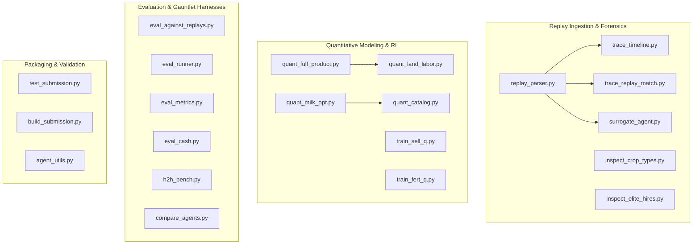

# Research Report 21: Scripts Reference and Developer User Guide

**Phase:** Tooling, Testing & Infrastructure Documentation  
**Generated:** 2026-09-24  
**Author:** Antigravity Autonomous Quantitative Research Team  

---

## 1. Overview & Architecture

The `scripts/` directory provides a comprehensive quantitative research, replay parsing, optimization, and evaluation infrastructure designed for the Kaggle Kaggriculture environment.

All tools are designed to work seamlessly with the local environment (`.venv/bin/python`) without modifying core simulator files (`src/kaggriculture/`):



---

## 2. Evaluation & Gauntlet Harnesses

### 1. `scripts/eval_against_replays.py`
**Purpose:** The primary benchmark harness. Replays recorded actions of real-world ladder opponents (Rank 1, 2, 3 players) tick-by-tick against a candidate agent on the exact match seeds from historical Kaggle logs.

- **Syntax:**
  ```bash
  .venv/bin/python scripts/eval_against_replays.py <agent_path> [--quick] [--player {0,1}]
  ```
- **Arguments:**
  - `<agent_path>`: Path or name of agent (e.g., `two_team_grandmaster`, `agent_two_team_grandmaster.py`, `sovereign_apex`).
  - `--quick`: Runs only the top 4 landmark replays instead of all 20.
  - `--player`: Player seat for our agent (`0` default, or `1`).
- **Example:**
  ```bash
  .venv/bin/python scripts/eval_against_replays.py two_team_grandmaster
  ```
- **Output:** Outputs per-replay match results, seed, opponent name, final cash, score margin, and overall win rate.

---

### 2. `scripts/eval_runner.py`
**Purpose:** Replay evaluation runner implementing the Phase 2 Evaluation Contract. Executes candidate agents against replay seeds and surrogate baselines, evaluating action divergence and counterfactual margins.

- **Syntax:**
  ```bash
  .venv/bin/python scripts/eval_runner.py --candidate <agent_path> [--replays-dir <dir>] [--output <out.md>]
  ```
- **Arguments:**
  - `--candidate`: Path to agent to evaluate.
  - `--replays-dir`: Path to replay directory (defaults to `replays`).
  - `--output`: Markdown output destination (defaults to `eval_results.md`).
- **Example:**
  ```bash
  .venv/bin/python scripts/eval_runner.py --candidate two_team_grandmaster --output eval_grandmaster.md
  ```

---

### 3. `scripts/eval_metrics.py`
**Purpose:** Formal evaluation metrics library. Defines the [`EvaluationResult`](file:///Users/pranav/dev/kaggriculture/scripts/eval_metrics.py#L11-L26) dataclass and formats markdown reports covering:
- **Seed-Matched Delta:** Candidate cash minus surrogate baseline cash.
- **Counterfactual Margin:** Candidate cash minus historical replay opponent cash.
- **Divergence Rate:** Proportion of surrogate or fallback turns.

---

### 4. `scripts/eval_cash.py`
**Purpose:** Evaluates an agent's end-of-season bank cash across standard benchmark seeds against a passive PASS opponent or head-to-head.

- **Syntax:**
  ```bash
  .venv/bin/python scripts/eval_cash.py <agent_path> [pass|opponent_path] [seeds...]
  ```
- **Example:**
  ```bash
  .venv/bin/python scripts/eval_cash.py agent_final.py pass 1 3 5 7 10 15 20
  ```
- **Output:** Reports Day 30 terminal cash, herd count, unlocked quadrants, and wholesale milk price.

---

### 5. `scripts/h2h_bench.py`
**Purpose:** Runs head-to-head simulated matches between two active agents across multiple seeds, alternating seats to eliminate first-player bias.

- **Syntax:**
  ```bash
  .venv/bin/python scripts/h2h_bench.py <agent_a> <agent_b> [--seeds N] [--start-seed S]
  ```
- **Example:**
  ```bash
  .venv/bin/python scripts/h2h_bench.py two_team_grandmaster submissions/care_mill/main.py --seeds 10
  ```

---

### 6. `scripts/compare_agents.py` & `scripts/benchmark_core.py`
**Purpose:** Statistical comparison runner recording detailed CSV telemetry metrics for two agents across N seeds.

- **Syntax:**
  ```bash
  .venv/bin/python scripts/compare_agents.py <agent_a> <agent_b> --seeds 20 --output results.csv
  ```
- **Metrics Tracked:** Terminal cash, shed overflow events, market slots burned, mean price impact, collision holds/releases.

---

## 3. Replay Ingestion, Tracing & Forensics

### 1. `scripts/replay_parser.py`
**Purpose:** High-performance, streaming parser for Kaggle JSON replays. Extracts compact step-by-step records without loading large JSON payloads into memory repeatedly.

- **Syntax:**
  ```bash
  .venv/bin/python scripts/replay_parser.py <replay_file> [--summary]
  ```
- **Example:**
  ```bash
  .venv/bin/python scripts/replay_parser.py replays/other_agents/rank1/112542379.json --summary
  ```

---

### 2. `scripts/surrogate_agent.py`
**Purpose:** High-fidelity replay emulator and deterministic fallback agent. Replays recorded actions from historical JSON steps, ensuring strict compliance with game action formats. If a turn action is malformed, it triggers a deterministic high-value liquidation fallback.

---

### 3. `scripts/trace_replay_match.py`
**Purpose:** Interactive step-by-step match forensic tracer. Runs a live simulation of a candidate agent against a historical replay opponent, outputting daily cash balances, tile counts, animal populations, and turn actions.

- **Syntax:**
  ```bash
  .venv/bin/python scripts/trace_replay_match.py <replay_path> <agent_path>
  ```
- **Example:**
  ```bash
  .venv/bin/python scripts/trace_replay_match.py replays/other_agents/rank1/112542379.json two_team_grandmaster
  ```

---

### 4. `scripts/trace_timeline.py` & `scripts/scratch_boey_timeline.py`
**Purpose:** Fast forensic snapshot tools. Extracts game state at Hour 2 (after dawn market orders and labor placement) across all 30 days for both players in a replay file.

- **Syntax:**
  ```bash
  .venv/bin/python scripts/trace_timeline.py <replay_path>
  ```
- **Example:**
  ```bash
  .venv/bin/python scripts/trace_timeline.py replays/other_agents/rank1/112542379.json
  ```

---

### 5. Replay Inspection Utilities
- **`scripts/inspect_replays.py`**: Scans all replays in `replays/` and prints summary statistics (seed, opponent name, final money, quadrant count).
- **`scripts/inspect_crop_types.py`**: Samples Days 2, 5, 8, 12 across Rank 1, 2, 3 replays and tabulates crop distributions.
- **`scripts/inspect_elite_hires.py`**: Profiles dawn hand-hiring schedules and cash balances for top ladder players.
- **`scripts/inspect_ranks_2_3.py`**: Compares crop and livestock asset allocations across Rank 2 and 3 replays.
- **`scripts/diagnose_run.py`**: Single-seed diagnostic runner printing Day 1 to Day 29 progression of an agent against a PASS bot.

---

## 4. Quantitative Optimization & Modeling

### 1. `scripts/quant_full_product.py`
**Purpose:** Comprehensive SciPy optimizer for joint multi-product sales, stage-aware liquidation thresholds, and herd ramp schedules.

- **Syntax:**
  ```bash
  .venv/bin/python scripts/quant_full_product.py [--quick] [--product <item>] [--drain <rate>]
  ```
- **Example:**
  ```bash
  .venv/bin/python scripts/quant_full_product.py --product MILK --drain 24
  ```

---

### 2. `scripts/quant_land_labor.py`
**Purpose:** Pre-analysis tool calculating the Marginal Product of Labor (MPL), action requirements per workforce size (1-8 hands), and the exact Day breakeven formula for unlocking the Northeast quadrant ($1,000).

- **Syntax:**
  ```bash
  .venv/bin/python scripts/quant_land_labor.py
  ```

---

### 3. `scripts/quant_milk_opt.py` & `scripts/quant_catalog.py`
**Purpose:** Fits 4-stage pricing curves using `scipy.optimize.minimize` based on official market absorption parameters ($I_0 = 10,000$, shop drain rates, quadratic wool impact).

- **Syntax:**
  ```bash
  .venv/bin/python scripts/quant_milk_opt.py
  .venv/bin/python scripts/quant_catalog.py
  ```

---

### 4. Reinforcement Learning Trainers
- **`scripts/train_sell_q.py`**: First-visit Monte Carlo Q-learning optimizing daily milk sales ceilings across paired greedy/epsilon-greedy episodes. Saves learned policy to `q_values.json`.
- **`scripts/train_fert_q.py`**: First-visit Monte Carlo Q-learning optimizing daily fertilizer price floor thresholds.
- **`scripts/probe_dawn.py`**: Explores dawn wage pricing mechanisms and labor bidding.

---

## 5. Packaging & Validation Tools

### 1. `scripts/test_submission.py`
**Purpose:** Official submission validator and performance profiler. Runs a candidate submission over a full 30-day season (720 turns) to verify:
- No execution timeouts (<2ms per turn).
- Valid action dictionary schemas.
- Zero uncaught exceptions.
- Output compliance.

- **Syntax:**
  ```bash
  .venv/bin/python scripts/test_submission.py <submission_path> [--steps 720] [--seed 42]
  ```
- **Example:**
  ```bash
  .venv/bin/python scripts/test_submission.py submissions/agent_final
  ```

---

### 2. `scripts/build_submission.py`
**Purpose:** Packages agent code and supporting libraries into Kaggle-compliant submissions:
- Generates self-contained standalone single-file `main.py`.
- Or packages bundled `submission.tar.gz` with dependencies.

- **Syntax:**
  ```bash
  .venv/bin/python scripts/build_submission.py <source_path> [--output <dest>]
  ```
- **Example:**
  ```bash
  .venv/bin/python scripts/build_submission.py submissions/agent_final
  ```

---

### 3. `scripts/agent_utils.py`
**Purpose:** Core utility library providing [`load_agent`](file:///Users/pranav/dev/kaggriculture/scripts/agent_utils.py#L12-L35). Dynamically loads agents from:
- File paths (e.g. `agent_two_team_grandmaster.py`).
- Directory packages (e.g. `submissions/two_team_grandmaster`).
- Named agent aliases with isolated module namespaces to prevent variable cross-contamination during multi-agent evaluations.
