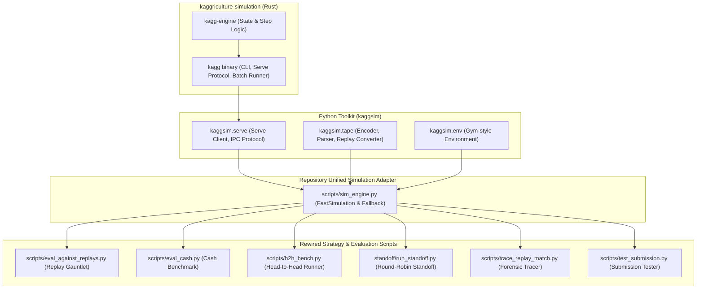

# Kaggriculture Simulation Engine: User & Developer Guide

This document describes the high-performance simulation architecture powered by **`kaggriculture-simulation`** (a byte-identical Rust port of the official Kaggle Kaggriculture engine) and how all simulation, evaluation, and benchmark workflows in this repository are rewired to leverage it.

---

## 1. Executive Summary & Speedup Benchmarks

`kaggriculture-simulation` compiles down to a native binary (`kagg`) that runs the entire turn-based agricultural economics simulation with **100% byte-identical parity** to the official Kaggle simulator (`kaggle-environments==1.32.7`), while operating at orders of magnitude higher throughput.

### Performance Comparison

| Workflow / Tool | Official Python Engine (`kaggle_environments`) | Rust Engine (`kaggriculture-simulation`) | Speedup |
|---|---|---|---|
| **Single 720-step Match** | ~2.5 – 3.0 seconds | **~0.30 – 0.50 seconds** | **~6× – 10× faster** |
| **Tape Replay Execution** | ~1.5 seconds / game | **~3.4 milliseconds / game (293 episodes/sec)** | **~440× faster** |
| **20-Replay Gauntlet** | ~60 – 90 seconds | **~6 – 10 seconds** | **~10× faster** |
| **62-Agent Standoff Tournament** | ~150 – 180 seconds | **~23 seconds** | **~7× faster** |
| **14-Seed Cash Benchmark** | ~25 – 35 seconds | **~4.5 seconds** | **~7× faster** |

---

## 2. Architecture & Components

The simulation infrastructure consists of:



### 1. The Rust Binary (`kagg`)
Located at `kaggriculture-simulation/src-rust/target/release/kagg`. It provides line-oriented IPC (`kagg serve`), parallel tournament execution (`kagg tournament`), and batch tape rollouts (`kagg batch`).

### 2. The Python Toolkit (`kaggsim`)
Installed in editable mode in the project's virtual environment (`.venv`). Contains the IPC client, tape parsers, and observation serializers.

### 3. The Unified Engine Adapter (`scripts/sim_engine.py`)
Provides `FastSimulation` as a persistent context manager. Automatically detects the compiled binary, routes actions across the pipe, and falls back seamlessly to `kaggle_environments` if the `--official` flag is used.

---

## 3. How to Use the Rewired Simulation Tools

All primary evaluation and strategy scripts have been updated to use the fast engine by default.

### A. 20-Replay Gauntlet Benchmark (`scripts/eval_against_replays.py`)
Runs any agent against the recorded step-by-step actions of elite ladder opponents on exact match seeds:
```bash
# Evaluate candidate across all 20 replays in ~6-8 seconds
python scripts/eval_against_replays.py scratch_grandmaster.py

# Evaluate against top 4 landmark replays only (~3 seconds)
python scripts/eval_against_replays.py scratch_grandmaster.py --quick

# Force execution on official python runner if needed
python scripts/eval_against_replays.py scratch_grandmaster.py --official
```

### B. Head-to-Head Match Benchmark (`scripts/h2h_bench.py`)
Pits two agents against each other on shared seeds with position swapping:
```bash
# Run 5 seeds (10 matches) in ~3 seconds
python scripts/h2h_bench.py scratch_grandmaster.py submissions/care_mill/main.py --seeds 5
```

### C. Cash Benchmark Across Seeds (`scripts/eval_cash.py`)
Evaluates terminal cash across standard benchmark seeds against a passive PASS bot:
```bash
# Evaluates 7 benchmark seeds in ~2.5 seconds
python scripts/eval_cash.py scratch_grandmaster.py pass 1 3 5 7 10 15 20
```

### D. Full Standoff Tournament (`standoff/run_standoff.py`)
Runs a complete round-robin tournament against all 62 agents in `submissions/`:
```bash
# Runs 62 full 720-turn matches in ~23 seconds
python standoff/run_standoff.py -a agent_final --no-swap

# Run with starting position swap (124 matches)
python standoff/run_standoff.py -a agent_final
```

### E. Match Forensic Tracer (`scripts/trace_replay_match.py`)
Prints step-by-step cash, animal counts, crop counts, and market prices against a replay opponent:
```bash
# Traces match in ~0.5 seconds
python scripts/trace_replay_match.py replays/my_agents/agent_final:\ Sovereign\ Apex\ k+/112619304.json scratch_grandmaster.py
```

### F. Submission Validator (`scripts/test_submission.py`)
Tests submission integrity, turn latency, and schema compliance:
```bash
# Tests full season in ~0.6 seconds (<1ms/turn)
python scripts/test_submission.py -a1 scratch_grandmaster.py -a2 submissions/care_mill/main.py

# Test with HTML replay generation (forces official visual renderer)
python scripts/test_submission.py -a1 scratch_grandmaster.py -a2 random --render
```

---

## 4. Python API: Using `FastSimulation` Directly

You can integrate the fast engine directly into your own training loops, RL scripts, or optimization algorithms:

```python
from sim_engine import FastSimulation, is_kagg_available

# 1. Run a match between two agents
with FastSimulation() as sim:
    cash0, cash1, final_state = sim.run_match(
        agent0="scratch_grandmaster.py",
        agent1="submissions/care_mill/main.py",
        seed=42,
    )
    print(f"P0: ${cash0:,.0f} | P1: ${cash1:,.0f}")

# 2. Run against a historical replay
with FastSimulation() as sim:
    our_m, opp_m, won, _ = sim.run_replay(
        agent="scratch_grandmaster.py",
        replay_data_or_path="replays/other_agents/rank1/112542379.json",
        our_player=0,
    )
    print(f"Result: {'WIN' if won else 'LOSS'} | Margin: ${our_m - opp_m:,.0f}")
```

### Using the Gym-Style Environment (`kaggsim.env.Env`)

For RL agents, a standard Gym-style step interface is available:

```python
from kaggsim.env import Env

with Env() as env:
    (obs0, obs1) = env.reset(seed=123)
    done = False
    while not done:
        action0 = my_agent(obs0)
        action1 = opp_agent(obs1)
        (obs0, obs1), (reward0, reward1), done, info = env.step(action0, action1)
    
    print("Final banks:", info["banks"])
```

---

## 5. Replay Tapes & Pure Rust Benchmarks

All 20 replays in `replays/` have been pre-converted to line-oriented `.tape` files in `replays/tapes/` using `scripts/build_replay_tapes.py`.

### Running Pure Native Rust Benchmarks
To test raw simulation throughput without Python IPC overhead:
```bash
# Runs 100 repetitions of Boey's match (71,900 turns) in ~0.34s
./kaggriculture-simulation/src-rust/target/release/kagg bench replays/tapes/112542379_both.tape 100
```
Output:
```json
{"steps": 71900, "seconds": 0.3412, "steps_per_sec": 210744, "episodes_per_sec": 293.11, "sink": 11551800}
```

### Converting New Replays to Tapes
If you download new Kaggle replay JSONs into `replays/`:
```bash
python scripts/build_replay_tapes.py
```
This automatically produces:
- `<id>_opp_seat<N>.tape`: Single-seat action stream for fast opponent playback.
- `<id>_both.tape`: Interleaved two-seat episode stream for native throughput testing.

---

## 6. Verifying Parity & Rebuilding

### Verifying Differential Parity
To prove that the Rust engine produces state identical to the official engine:
```bash
cd kaggriculture-simulation
python -m kaggsim.fidelity certify --episodes 20
```

### Rebuilding the Rust Engine
If you modify code in `kaggriculture-simulation/src-rust/`:
```bash
cd kaggriculture-simulation
cargo build --manifest-path src-rust/Cargo.toml --release -j 4
```
The recompiled executable at `src-rust/target/release/kagg` is immediately picked up by `sim_engine.py`.
